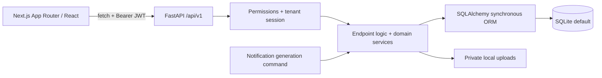

# VehicleManagement 2.0 — Agent Guide

Source-checked 2026-09-15. Repository/UI names also include VehicleFleetControl / Vehicle Fleet Control. Paths are repository-relative. Table prefixes: **E** = `backend/app/api/v1/endpoints/`, **S** = `backend/app/services/`, **F** = `frontend/app/`, **C** = `frontend/src/components/`. Concatenate prefix and path.

## 1. Project Overview

A fleet operations application for administrators, fleet managers, mechanics, drivers, finance staff, and viewers. It manages vehicles, drivers, handovers, maintenance, stock/purchasing, fuel/charging, document compliance, accidents/claims, reservations, reporting, and administration in English and Albanian.

**Implemented:** company registration/switching, tenant isolation, permission administration, lifecycle/TCO reports, vehicle/driver imports, in-app notifications, service programs, and inspection templates/schedules.

**Partial/stubbed:** antivirus is a no-op. Imports cover Vehicles, Drivers, historical Services, Fuel/Charging, Assignments, Documents Metadata, Vendors, and Parts; live assignment activation remains in the handover workflow. Company isolation is a SaaS foundation; billing/subscriptions, email/SMS delivery, and an installed periodic scheduler are absent.

**Actual database:** SQLite is configured in examples, Compose, and tests. SQL Server is intended in the brief but has no configured driver, container, or verified migration workflow.



## 2. Technology Stack

| Layer | Technology | Purpose |
|---|---|---|
| Web | Next.js 14.2, React 18, TypeScript 5.8 | App Router, interactive client pages, strict type checking |
| Presentation | Global CSS, one inspection-template CSS module | Shared controls, layouts, tables; no Tailwind/UI framework |
| Localization | i18next/react-i18next; Python translation dictionaries | English `en` and Albanian `sq`, errors, formatting, audit/notification labels |
| API | FastAPI, Uvicorn, Pydantic 2, pydantic-settings | REST, request/response validation, environment settings |
| Persistence | SQLAlchemy 2, Alembic | Synchronous sessions, relationships, tenant filtering, versioned migrations |
| Authentication | python-jose, passlib/bcrypt | Signed JWTs, password hashing, revocable sessions |
| Files/reports | python-multipart, openpyxl | Upload parsing and XLSX imports/exports; CSV uses Python standard library |
| Verification | pytest, unittest, HTTPX/TestClient; Playwright, ESLint | Backend rules/migrations and mocked browser workflows |
| Development | Python 3.11+ / Node 18+ per README; Compose uses Python 3.12 / Node 20 | Two separately started applications |

Dependencies/scripts: `backend/requirements.txt`, `frontend/package.json`. Frontend has `package-lock.json`; Python has unpinned ranges.

## 3. Repository Structure

```text
.
├── AGENTS.md
├── README.md
├── docker-compose.yml
├── scripts/                       # run-local.sh / run-local.bat
├── docs/                          # domain details and historical analyses
├── backend/
│   ├── app/
│   │   ├── main.py
│   │   ├── models.py              # all ORM entities
│   │   ├── schemas.py             # main DTOs/enums (a file, not a package)
│   │   ├── *_schemas.py           # supply, programs, inspection templates
│   │   ├── api/v1/router.py
│   │   ├── api/v1/endpoints/
│   │   ├── core/                  # configuration, security, authorization, errors/i18n
│   │   ├── db/                    # session and deprecated migration helpers
│   │   ├── services/              # shared domain workflows
│   │   ├── utils/                 # dates, plates bridge, uploads, catalog helpers
│   │   ├── scripts/               # audits, validation, catalog seed, notifications
│   │   └── data/vehicle_catalog.json
│   ├── alembic/versions/
│   ├── alembic.ini
│   ├── tests/                     # includes historical SQL fixtures
│   └── data/                      # ignored runtime databases/backups
└── frontend/
    ├── app/                       # routes, root layout, global CSS
    ├── src/components/            # reusable and domain components
    ├── src/lib/                   # API, auth, types, formatting, constants
    ├── src/i18n/locales/{en,sq}/
    ├── scripts/                   # localization checks
    └── tests/                     # Playwright specs
```

Endpoints coordinate ORM writes and domain services; **no repository/data-access layer** exists. Routes live in `frontend/app/`; reusable implementation lives in `src`. `docs/PROJECT_ANALYSIS.md` and restoration notes are historical. This shared-module architecture needs only one root guide.

## 4. Frontend Architecture

`F/layout.tsx` installs LanguageProvider/AppShell, which installs AuthProvider. `F/page.tsx` redirects to `/dashboard`. Client feature pages use local state/effects. No Next API handlers, server-action backend, Redux, React Query, or form library exists.

| Area | Location | Responsibility / placement |
|---|---|---|
| Routes | `F/<feature>/page.tsx`, detail `[id]/page.tsx` | New pages and page-owned forms; vehicle edit is `F/vehicles/edit/[id]/page.tsx` |
| Shell/navigation | `C/layout/AppShell.tsx`, `C/maintenance/Maintenance.tsx` | Login redirect, permission-filtered navigation, company switch, notification polling every 60 seconds |
| Shared UI | `C/ui/` | `CreateEntityDialog`, `EntityPageHeader`, `SearchableCombobox` |
| Vehicle form | `C/vehicles/VehicleForm.tsx` | Shared create/edit form, country plates, catalog selection, lifecycle fields |
| Maintenance | `C/maintenance/` | Completion dialog, inspection results, program compliance, maintenance layout |
| Supply | `C/supply/MasterPage.tsx`, `WorkOrderWorkspace.tsx`, `shared.tsx` | Master CRUD, order tabs, `useSupplyData` with stale-response protection |
| Dashboard | `C/dashboard/` | Small panels fed by one overview response |
| HTTP | `frontend/src/lib/api.ts` | Generic JSON/form/blob helpers; catalog, registration, maintenance, assignments, file wrappers |
| Types/utilities | `frontend/src/lib/types.ts`, `constants.ts`, `format.ts`, `energy.ts`, `licensePlates.ts` | API shapes, enum labels, dates, energy/plate behavior; some newer feature types remain local |
| Language | `frontend/src/i18n/`, `C/i18n/` | Namespaced translations and language/formatting context |

Forms use controlled inputs, HTML constraints, and manual validation. Reuse domain forms. Styles: `F/globals.css`, with `F/admin/inspection-templates/templates.module.css` as a scoped exception. `@/` resolves to `frontend/src/`.

`api.ts` sends Bearer tokens from localStorage plus `Accept-Language`; GET uses `cache: "no-store"`. Errors become localized `Error` messages; 401 clears the token and dispatches `auth:logout`. `auth.tsx` restores `/auth/me`, manages login/registration/company switching, and exposes `can()`. UI gating is not backend authorization. Password-reset-required users are directed to `/account/password`.

## 5. Backend Architecture

`backend/app/main.py` registers CORS, HTTP/validation exception handlers, `/health`, and `api_router` under configurable `/api/v1`. It does not create tables or migrate at startup. `backend/app/api/v1/router.py` registers all feature routers, including supply routes **without an extra prefix**.

Flow: request → dependencies/validation → endpoint/shared service → SQLAlchemy → explicit commit → output DTO. Most handlers are synchronous; async handlers mainly read uploads. Logic lives in endpoints and S services, which sometimes import endpoint helpers.

`backend/app/db/session.py` creates one engine and request-scoped `TenantSession`; `get_db` closes it in `finally`, but does not commit automatically. Authentication sets `db.info` company/user/role context. ORM loader criteria scope `TenantMixin` records; flush hooks check new/dirty tenant ownership. Unscoped sessions, identity-map reuse, raw SQL, and bulk operations need particular care: validate related IDs and explicitly constrain company ownership. The notification job clears the identity map between companies.

`core/security.py` handles JWT identity/company/session-version checks. `core/authorization.py` owns permission catalog, six default roles, custom role grants, and location/department/cost-center/own-record scopes; endpoints must apply those scopes. Roles/permissions are global definitions, while grants and operational data are company-owned. Legacy role/membership fallback remains.

`core/errors.py` returns `{code, message, params}` or 422 `{code, message, field_errors}`. Prefer explicit codes: fallback inference can conceal errors. `S/audit.py` snapshots/redacts AuditLog data. Other logging is Uvicorn/Alembic output; no central structured logging setup exists.

## 6. Core Data Model

All entities: `backend/app/models.py`. Primary keys are integer `id` / SQL `Id`; tenant records inherit `CompanyId`. Attributes are snake_case, SQL names PascalCase; money/quantities use Numeric/Decimal.

| Entity/group | Key fields, relationships, constraints |
|---|---|
| `Company`, `CompanySettings`, `CompanyUser` | Unique company slug; one settings row/company (language, timezone, currency, logo, notification rules); unique company/user membership with role/active/default flags |
| `User`, `Role`, `Permission`, `RolePermission`, `UserRole` | Globally unique normalized login email; hash, active flag, language, session version; unique role/permission codes; tenant role grants carry optional organizational scope |
| `VehicleBrand`, `VehicleModel` | Global catalog; normalized brand name unique, model name unique within brand; active flags |
| `Vehicle` | Country, formatted/normalized plate, brand/model IDs and display snapshots, fuel type, location/category, integer status, odometer; purchase/lease/warranty/disposal/capacity fields. Unique `(CompanyId, RegistrationCountry, LicensePlateNormalized)`, including archives |
| `Driver` | Employee/license identifiers, expiry/status, optional linked user and legacy assigned vehicle, department/cost center; company-scoped uniqueness for email, employee number, license number, user |
| `VehicleAssignment`, `VehicleConditionRecord` | Vehicle/driver/reservation, start/end times, odometer/energy, handover data/status. One active/overdue assignment per vehicle and driver; one Checkout/Return condition record per assignment |
| `VehicleReservation` | Vehicle FK, `reserved_by` free text (not a User FK), type, inclusive date range, numeric status/archive |
| `Inspection`, `InspectionItem` | Vehicle/driver/assignment, type/date, overall result, template/item JSON snapshots, schedule occurrence, completion timestamp, evidence attachment IDs |
| `InspectionTemplate`, `InspectionTemplateItem`, `InspectionTemplateAssignment`, `InspectionSchedule` | Company-scoped template code, ordered checklist policies, selector/priority, calendar/mileage/handover schedule; unique scheduled occurrence and work-order item links prevent duplication |
| `WorkOrder`, `VehicleService`, `ServiceBill` | Order source/status/priority, inspection/reminder/accident links, completion and cost fields; service type/date/odometer and manual reminder thresholds; one service per linked order; multiple service bill paths |
| `ServiceProgram`, `ServiceProgramTask`, `ServiceProgramRule`, `VehicleServiceProgram`, `ServiceProgramReminder` | Reusable tasks/intervals, selectors, governing vehicle assignment/baseline, due/resolved reminder history; one active assignment/vehicle and one active reminder/assignment/task |
| `VehicleFuel` | Vehicle/assignment, date, quantity, `unit` (`L`/`KWH`), unit/total cost, station, odometer, bill; positive quantity/nonnegative price constraints; legacy liters fields and review flag retained |
| `VehiclePaper`, `DocumentRequirement`, `DocumentVersion` | Vehicle **or** driver document; country/category/driver requirement rules; version number, dates, attachment, verification/renewal state; unique document/version number and one current version |
| `VehicleAccident`, `AccidentClaim`, `AccidentParty`, `AccidentInjury`, `AccidentFile` | Vehicle/driver/assignment/reservation links, safety/state/damage; one claim/accident, company-unique claim number; parties/injuries and legacy attachment paths |
| Supply entities | `Vendor`, `PartCategory`, `Part`, `PartInventory`, `InventoryTransaction`, `PurchaseOrder`, `PurchaseOrderItem`, `WorkOrderPart`, `Technician`, `WorkOrderTechnician`, `LaborEntry`, `WorkOrderVendorCharge`: stock per part/location, purchase receipt quantities, issue/return ledger, labor clocks/rates, order charges |
| Lifecycle/organization | `Supplier` is vehicle acquisition, distinct from maintenance `Vendor`; `VehicleOperatingCost` stores Insurance/Registration/Other Operating amounts; `Location`, `Department`, `CostCenter` have company-unique codes |
| Infrastructure records | `Attachment`: unique stored name/path + polymorphic entity type/ID; `AuditLog`: redacted changes/actor; `Notification`: company-unique deduplication key and recipient/status; `ImportJob`/`ImportRowResult`: source, mappings, status/counts/errors, unique job/row number |

## 7. Business Rules

### Vehicles, drivers, reservations, handovers

- `S/license_plates.py` supports ordinary **AL** and **XK** plates only. Strip spaces/hyphens and uppercase for uniqueness/search; format AL as `AA 123 AA`, XK as `01-123-AB`. XK region 01–07, number 101–999; suffix disallows `T R V W X Y`. Preserve catalog display snapshots and allow unchanged historical inactive catalog selections on edit.
- Status contracts are numeric: Vehicle `0 Active, 1 InService, 2 Sold, 3 OutOfUse, 4 Assigned`; Reservation `0 Pending, 1 Approved, 2 Rejected, 3 Cancelled, 4 Completed`. Assignment/order/inspection statuses are separate string enums in `schemas.py`.
- Checkout requires available Vehicle, active/unexpired Driver, no assignment/legacy-link conflicts, nondecreasing odometer, and valid linked reservation approval/times. Start/check-out sets Assigned and driver links; return/complete updates usage, mileage, reservation, conditions/damage while preserving safety-related OutOfUse.
- Assignments: Scheduled → Active/Overdue → Completed/Cancelled; only Scheduled is editable. Energy is 0–100%; end mileage ≥ start. Preserve both start/check-out and complete/return entry points.
- Reservation creation rejects inclusive overlap with any unarchived reservation except Cancelled. **Suspicious:** Rejected and Completed rows also block; approval/restoration do not recheck overlap; creation does not enforce vehicle availability/archive status. Completed reservations cannot reopen. Do not silently change these semantics.
- Deletes usually archive history; vehicle/driver archive protects active usage. Check endpoint-specific restore/permission rules; avoid physical deletion.

### Maintenance, inventory, costs

- Manual General Service/Oil Change requires odometer and interval **5000/10000/15000 km**; target = recorded odometer + interval. Tire Change/Control requires next date; equality with service date is accepted despite an error message saying “after.” Other types have no automatic manual deadline (`E/services.py`). A matching program task permits omitted manual thresholds.
- Manual reminder overrides Resolved/Dismissed win; otherwise past date/km is Overdue, equality Due, within **30 days / 1000 km** Due Soon. Latest reminder selection is by vehicle/type, service date then ID (`S/maintenance_metrics.py`). Preserve this separately from program reminders.
- Service/fuel/completion writes reject odometers below the vehicle's current reading; this also constrains historical editing. Do not assume universal historical backfill support.
- `S/work_order_completion.py` atomically completes an order, calculates costs, optionally creates one Service, resolves reminders, updates odometer, audits, and notifies. Repeat completion returns 409; archived/cancelled/linked orders and active labor clocks block it. Completion cannot be future-dated or before order creation.
- `S/maintenance_supply.py` guards stock changes in SQL. Available = on hand − reserved; issues/transfers/write-offs cannot consume reserved stock. Returns reference an issued order line and cannot exceed outstanding quantity. Quantities round to 3 decimals, money to 2, half-up.
- Order totals = parts + labor + external vendor + tax + other − discount, never negative. Categories with line history use active line sums; legacy manual subtotals survive only where no line history exists. Closed/linked orders lock supply edits. Purchase receipts update stock and receipt history together; labor clocks must not overlap.
- Reporting counts Services plus completed **unlinked** orders, avoiding duplicate maintenance costs. TCO adds energy, operating costs, lease/depreciation and uses odometer deltas for efficiency; missing history stays unknown. Replacement recommendations are deterministic rules (`S/tco.py`). Inventory valuation uses current catalog unit cost, not FIFO.

### Programs, inspections, documents, safety

- Program precedence: Vehicle → exact Brand/Model → Brand → Department → Location → Category → FuelType; newest rule/ID wins ties. Only active/effective rules/programs compete. Department comes through drivers/assignments, not a Vehicle department field.
- Program deadlines use completed services/frozen baselines, positive km/calendar-month intervals, OR/AND thresholds, month-end clamping, and Needs Baseline for unknown mileage. Reminders remain separate from Services; automatic orders are deduplicated. Preserve `after_flush`/`before_commit` synchronization hooks. Details: `S/service_programs.py`, `docs/maintenance-programs.md`.
- Inspection precedence: Vehicle → Brand/Model → Category → FuelType → Location → Department; higher priority, then lowest assignment ID wins ties. Begin freezes template/item snapshots; updates submit original IDs/names; completion requires checked required items and locks results.
- Failed items enforce configured comment/photo evidence, may create one order/item, set OutOfUse, and notify. Passing later does not clear safety status or close repair orders. Scheduled checkout inspections must be completed/passed for the current UTC day/handover cycle; return schedules create a snapshot per return. Details: `S/inspection_templates.py`, `docs/inspection-templates.md`.
- Document status prioritizes archive/rejection/renewal state over expiry. Expiry today is Expiring Soon; expired means before today. Valid and Expiring Soon count compliant. Renewals preserve versions; country/category requirements apply to vehicles, driver requirements cannot have those filters (`S/document_compliance.py`).
- Accident transition rules live in `E/accidents.py:STATUS_TRANSITIONS`. The dedicated resolve action requires finished/cancelled repair orders and a Closed/Rejected claim; close-claim requires Settled/Rejected/Approved. **Inconsistency:** generic transition handling checks the state graph without the dedicated resolve action's checks.
- Fuel type/unit derive from Vehicle: Electric uses KWH; other supported types, including Hybrid, use L. Total = quantity × unit cost rounded half-up. Keep L/KWH totals separate, retain migration review flags, and honor `fuel.view_cost` redaction.

## 8. API Reference Map

Paths are relative to `/api/v1`; placeholders are descriptive. This map omits some CRUD variants; DTOs and `/docs` give contracts. Register fixed routes before catch-all plate/ID routes.

| Domain | Method / route | Purpose | File under E |
|---|---|---|---|
| Auth | POST `/auth/register`, `/auth/login`, `/auth/switch-company`; GET `/auth/me`; PUT `/auth/me/language`, `/auth/me/password` | Company onboarding, JSON login, session/preferences | `auth.py` |
| Admin | GET/POST `/admin/users`, `/admin/roles`; PUT respective `/{id}`; GET/PUT `/admin/company-settings`; GET/POST logo; GET/POST `/admin/{kind}` | Users, grants, company/organization settings | `admin.py` |
| Vehicles | GET/POST `/vehicles`; GET/PUT/DELETE `/vehicles/{id}`; POST restore; GET maintenance-summary/timeline; GET/POST operating-costs | Fleet, lifecycle, archive, maintenance context | `vehicles.py` |
| Catalog | GET `/vehicle-registration/countries`, `/vehicle-catalog/brands`, `/vehicle-catalog/brands/{id}/models` | Plate metadata/catalog; catalog writes also exist | `vehicle_registration.py`, `vehicle_catalog.py` |
| Drivers | GET/POST `/drivers`; GET/PUT/DELETE `/drivers/{id}`; POST restore | Driver lifecycle | `drivers.py` |
| Usage | GET/POST `/vehicle-assignments`; POST `/vehicle-assignments/check-out`; POST `/{id}/start`, `/complete`, `/return`, `/cancel`; GET `/{id}/conditions` | Scheduled assignments and handovers | `vehicle_assignments.py` |
| Maintenance | GET `/maintenance/summary`; GET/POST `/work-orders`; GET/PUT `/{id}`; PUT `/{id}/status`; POST `/{id}/complete` | Order lifecycle/atomic completion | `maintenance.py`, `work_orders.py` |
| Services | POST `/services`, `/services/register-with-bill`, `/services/upload-bill-later`; GET `/services/history`, `/reminders`, `/id/{id}`; PUT `/id/{id}`, `/reminders/{id}/status` | History, bills, manual reminders | `services.py` |
| Programs | GET/POST `/maintenance/programs`, `/rules`; GET `/assignments`, `/options`, `/compliance`; POST `/synchronize`; GET/POST `/{id}/tasks` | Programs, assignment rules, compliance | `service_programs.py` |
| Inspections | GET/POST `/inspections`; GET/PUT `/inspections/{id}`; GET/POST `/inspection-templates`; GET `/resolve`; POST `/generate`; item/assignment/schedule subresources | Results and configuration | `inspections.py`, `inspection_templates.py` |
| Supply | GET/POST `/parts`, `/vendors`, `/technicians`, `/purchase-orders`, `/inventory-transactions`; GET `/inventory`, `/supply-options`; POST `/purchase-orders/{id}/receive`; order `/parts`, `/labor`, `/vendor-charges`; GET `/maintenance/reports/low-stock`, `/maintenance/reports/cost-breakdown` | Stock, procurement, workforce, costing | `maintenance_supply.py` |
| Fuel | POST `/fuel` (multipart); GET `/fuel/all`, `/overview`, `/overview/totals`, `/record/{id}`; PUT/DELETE `/fuel/{id}` | Refuel/charging, costs, archive | `fuel.py` |
| Papers | POST `/papers/upload`; GET `/papers/all`; DELETE `/papers/{id}` | Compatibility document workflow | `papers.py` |
| Compliance | GET/POST `/compliance/documents`, `/document-requirements`; POST `/documents/{id}/renew`, `/document-versions/{id}/verify`; GET `/documents/{id}/versions` | Requirements and versioned renewals | `compliance.py` |
| Accidents | POST `/accidents`, `/accidents/report`; GET `/accidents/all`, `/id/{id}/detail`; PUT `/id/{id}`; POST `/id/{id}/actions/resolve`, `/id/{id}/actions/close`, `/claim`, `/parties`, `/injuries` | Accident/claim workflows | `accidents.py` |
| Reservations | GET/POST `/reservations`; PUT `/reservations/{id}/status`, `/approve`, `/reject`; DELETE `/{id}`; POST restore | Booking and approval | `reservations.py` |
| Dashboard/reports | GET `/dashboard/overview`, `/summary`, `/filtered`; GET `/reports/tco`, `/fleet-summary`, `/fuel-costs`, `/service-costs`, `/vehicle-costs`, `/document-compliance`; GET `/reports/{report}/export` | Aggregates and CSV/XLSX exports | `dashboard.py`, `reports.py` |
| Files | GET/POST `/files`; GET `/files/{id}/download`, `/files/legacy/download`; DELETE `/files/{id}` | Private attachments | `files.py` |
| Imports/bulk | POST `/imports/upload`, `/imports/{id}/validate`, `/confirm`, `/cancel`; GET `/imports`, `/{id}`, `/{id}/errors`, `/templates/{entity_type}`; POST `/bulk-actions`; GET `/bulk-actions/export` | Staged imports and selected-record operations | `imports.py`, `bulk_actions.py` |
| Notifications/audit | GET `/notifications`, `/unread-count`; PUT `/notifications/read-all`, `/{id}/read`, `/resolve`, `/dismiss`; GET `/audit-logs` | Recipient state and audit browsing | `notifications.py`, `audit_logs.py` |

## 9. Frontend ↔ Backend Mapping

F/C paths use the opening prefixes. Calls use `frontend/src/lib/api.ts`; there is no Next.js proxy.

| Frontend feature / location | API used | Backend starting point |
|---|---|---|
| `F/vehicles/page.tsx`, `F/vehicles/new/page.tsx`, `F/vehicles/edit/[id]/page.tsx`, `C/vehicles/VehicleForm.tsx` | `/vehicles`, catalog, registration countries | `E/vehicles.py` |
| `F/vehicles/[id]/page.tsx` | Vehicle, operating costs, maintenance summary/timeline, programs | `E/vehicles.py`, `E/maintenance.py` |
| `F/drivers/page.tsx`, `F/drivers/[id]/page.tsx` | `/drivers`, assignments | `E/drivers.py` |
| `F/vehicle-assignments/page.tsx`, `[id]/page.tsx` | `vehicleAssignmentsApi`, vehicles/drivers/reservations, `/files` | `E/vehicle_assignments.py`, `S/vehicle_assignments.py` |
| `F/work-orders/page.tsx`, `[id]/page.tsx`, `C/maintenance/CompleteWorkOrderDialog.tsx`, `C/supply/WorkOrderWorkspace.tsx` | `/work-orders` including complete, parts/labor/charges/timeline | `E/work_orders.py`, `E/maintenance_supply.py` |
| `F/services/overview/page.tsx`, `F/services/[id]/page.tsx`, `F/services/reminders/page.tsx` | `/services/history`, `/id/{id}`, bill endpoints, `/reminders` | `E/services.py`, `S/maintenance_metrics.py` |
| `F/maintenance/programs/page.tsx`, `C/maintenance/Programs.tsx` | `/maintenance/programs` and rule/task/compliance subroutes | `E/service_programs.py`, `S/service_programs.py` |
| `F/inspections/page.tsx`, `[id]/page.tsx`, `C/maintenance/InspectionResults.tsx`, `F/admin/inspection-templates/page.tsx` | `/inspections`, `/inspection-templates/resolve`, configuration, `/files` | `E/inspections.py`, `S/inspection_templates.py` |
| `F/maintenance/{parts,inventory,vendors,purchase-orders,technicians,reports}/page.tsx` | Supply routes have no `/maintenance` prefix except reports | `E/maintenance_supply.py`, `S/maintenance_supply.py` |
| `F/fuel/page.tsx` | GET `/fuel/all`, POST form `/fuel`, PUT `/fuel/{id}` | `E/fuel.py` |
| `F/papers/page.tsx`, `F/compliance/documents/page.tsx` | Legacy papers vs requirement/document/version APIs | `E/papers.py`, `E/compliance.py` |
| `F/accidents/page.tsx`, `[id]/page.tsx` | `/accidents/all`, `/id/{id}/detail`, actions/claims/files | `E/accidents.py` |
| `F/reservations/page.tsx` | `/reservations`, approve/reject | `E/reservations.py` |
| `F/dashboard/page.tsx`, `C/dashboard/` | `/dashboard/overview` | `E/dashboard.py`, `S/dashboard.py` |
| `F/reports/page.tsx`, `F/reports/tco/page.tsx` | `/reports/*`, export | `E/reports.py`, `S/tco.py` |
| `F/imports/page.tsx` | Upload → validate mapping → confirm → job/errors | `E/imports.py`, `S/imports.py` |
| `F/login/page.tsx`, `F/account/password/page.tsx`, `F/admin/`, `F/notifications/page.tsx`, `F/audit-logs/page.tsx` | `/auth`, `/admin`, `/notifications`, `/audit-logs` | Matching E routers; auth/authorization core |

## 10. File Upload Architecture

`backend/app/utils/files.py:store_upload` checks extension, MIME, leading signature, size/emptiness, and destination boundaries. It streams 1 MiB chunks into UUID filenames, retains sanitized original names, and cleans partial writes on failure.

| Entry | Accepted category / storage subfolder |
|---|---|
| Service bill endpoints | PDF/images (`auto`), `bills` |
| Fuel multipart create | PDF/images (`auto`), `fuel-bills` |
| Papers and compliance create/renew | PDF (`document`), `documents` |
| Legacy accident report | Images, `accidents` |
| Generic `/files` | `document`, `image`, or `auto`; lowercased entity name |
| Company logo | Images, company-specific logo subfolder |
| `/imports/upload` | Separate `S/imports.py` pipeline; `imports` subfolder |

Imports support **10 MiB / 20,000 rows / 100 columns**, CSV/XLSX streaming, mapping validation, create-only/create-or-skip/explicit-update modes, and row/file transaction modes. Validation and execution stage/process 250-row chunks through existing ImportJob/ImportRowResult records. Confirm revalidates records and checks matched-record fingerprints. File mode requires all rows valid and rolls back all writes on failure; row mode uses savepoints. Private atomic progress sidecars support polling during SQLite write transactions. See `docs/imports.md` for identities, historical rules, permissions, and attachment association.

Default document limit **10 MiB**, image limit **8 MiB**; PDF/JPEG/PNG/WebP only. **Auto uses the larger 10 MiB limit for either category.** Extension and MIME are individually allowlisted; content signature follows MIME, so this is not full file-format validation. `ANTIVIRUS_PROVIDER` does not select a real scanner.

`Attachment` stores relative disk path, metadata, tenant, uploader, and entity type/ID. Legacy `ServiceBill`, `AccidentFile`, fuel/paper/version columns retain paths, often authenticated `/api/v1/files/{id}/download` URLs. Downloads check tenant/entity permissions and return attachment disposition, `nosniff`, private/no-store headers. No public `/uploads` static mount exists.

Frontend uses `apiPostForm` with browser-generated multipart boundaries and authenticated blob downloads (`apiDownloadFile`, `filesApi`). Do not use bare `<a href>` for protected files or extend legacy `fileHref` as a public serving mechanism. Generic attachment ownership/archive checks vary (see §19). Physical `delete_upload` is a no-op; retention cleanup is not implemented. Disk writes precede DB commit, so later transaction failures can leave orphan files.

## 11. Database

`DATABASE_URL` configures SQLAlchemy; the default resolves from backend working directory to `backend/data/vehiclemanagement.db`. Request mutations explicitly commit/rollback. Tenant isolation is application-level.

Alembic uses `Base.metadata`, `compare_type=True`, SQLite batch operations, and settings-based URL in `backend/alembic/env.py`. Current source head: **`20260914_0019`**. Migration history includes the intentional no-op `20260810_0015` legacy bridge before lifecycle revision `20260812_0015`; do not delete/reorder it. Early migrations bootstrap empty DBs from current metadata, while later migrations freeze definitions/check existing schemas. Test both fresh and populated upgrade paths.

From `backend/`, with dependencies/environment ready:

```sh
alembic current
alembic history
alembic revision --autogenerate -m "description"
alembic upgrade head
```

Review generated migrations, including tenant ownership, Numeric conversion, uniqueness, indexes, and history preservation. `python -m app.scripts.validate_numeric_migration` and `python -m app.scripts.validate_company_migration` are existing audits. Plate/energy audits and catalog seed also live in `backend/app/scripts/`. Back up business databases before migration. Supply revision `20260913_0017` deliberately blocks downgrade; `alembic downgrade -1` is not universally safe.

SQL Server needs driver/migration work: filtered indexes specify SQLite/PostgreSQL predicates, not MSSQL. SQLite runtime setup does not explicitly enable foreign keys; some tests do. `backend/app/db/migrations.py` is deprecated transition/test code.

## 12. Configuration and Environment Variables

Settings read backend `.env` relative to working directory; cached by `get_settings()`. Frontend reads `.env.local`. Never copy real secrets into documentation.

| Variable(s) | Controls |
|---|---|
| `APP_NAME`, `API_V1_PREFIX` | API title and router prefix (default `/api/v1`) |
| `DATABASE_URL` | SQLAlchemy connection URL |
| `ENVIRONMENT`, `DEBUG` | Production security checks / FastAPI debug |
| `CORS_ORIGINS` (alias `FRONTEND_ORIGINS`) | Comma-separated allowed browser origins |
| `JWT_SECRET_KEY` (alias `SECRET_KEY`), `JWT_ALGORITHM`, `ACCESS_TOKEN_EXPIRE_MINUTES` | JWT signing and lifetime |
| `UPLOAD_DIRECTORY` (alias `UPLOADS_DIR`) | Private upload root |
| `MAX_DOCUMENT_SIZE`, `MAX_IMAGE_SIZE` | Byte limits |
| `ALLOWED_DOCUMENT_TYPES`, `ALLOWED_IMAGE_TYPES` | Comma-separated MIME allowlists; extensions/signatures also constrain uploads |
| `ANTIVIRUS_PROVIDER` | Reserved setting; scanner currently no-op |
| `NEXT_PUBLIC_API_URL` | Browser-visible API base, default `http://localhost:8000/api/v1` |

Production rejects the development JWT default/keys under 32 characters, debug mode, or wildcard CORS. No upload retention, scheduler, SMTP, or SQL Server-specific environment variables exist. Reference examples: `backend/.env.example`, `frontend/.env.example`, root `.env.example` (Compose JWT override). Custom API prefixes need coordinated changes: security token URL, file URLs, and frontend origin/download helpers hardcode `/api/v1`.

## 13. Running the Project

### Backend

From repository root; copy examples only for initial setup, preserving existing local values:

```sh
cd backend
python3 -m venv .venv
source .venv/bin/activate
pip install -r requirements.txt
cp .env.example .env
alembic upgrade head
uvicorn app.main:app --reload --host 0.0.0.0 --port 8000
```

Set a private JWT secret. Windows activation: `.venv\Scripts\Activate.ps1` / `.venv\Scripts\activate`. `/health` checks liveness only; API docs: `http://localhost:8000/docs`.

### Frontend

In another terminal from repository root:

```sh
cd frontend
npm install
cp .env.example .env.local
npm run dev
```

Production frontend commands: `npm run build`, then `npm run start`. Development output is `.next-dev`; production build output is `.next` so builds do not replace a running dev server's files.

### Database and full workflow

Default SQLite needs no server. Start dependencies/environment → migrations → API → frontend. Register a **company administrator** through `/login` / `POST /api/v1/auth/register`; registration onboards each company.

Root `docker compose up` installs dependencies, migrates, and starts both bind-mounted development services. No Dockerfiles/production pipeline exist. Launchers: `bash scripts/run-local.sh` (macOS Terminal/fallback), `scripts/run-local.bat` (Windows).

From backend: `python -m app.scripts.seed_vehicle_catalog` seeds catalog; `python -m app.scripts.generate_notifications` processes active companies, reminders/programs, inspection requirements, and time-based alerts. Run the latter periodically using deployment scheduling; this repository does not install that schedule.

## 14. Testing

Backend: from activated `backend/`, run `pytest -q`. `backend/tests/` mixes pytest/unittest, in-memory SQLite/direct endpoint calls, TestClient, and temporary migration fixtures. `python -m unittest discover -s tests -v` misses pytest functions. Never test against operational data.

Frontend: from `frontend/`:

```sh
npm run lint
npm run build
npm run i18n:check
npm run i18n:scan
npm run test:e2e
```

Playwright requires Chromium, starts/reuses Next at `127.0.0.1:3000`, and mocks `localhost:8000/api/v1` in three specs. These are not live database integration tests. No Jest/Vitest or CI exists.

| Change | Focused verification |
|---|---|
| API/model/permissions | Domain tests, `test_permissions.py`, `test_tenant_isolation.py`; test HTTP dependencies as well as direct calls |
| Plates/fuel | `test_license_plates.py`, `test_vehicle_catalog.py`, `test_fuel_energy.py`; normalization, units, money, odometer |
| Handovers/reservations | `test_vehicle_assignments.py`, `test_vehicle_checkout_return.py`; overlap/status/conflicts and both handover entry points |
| Completion/supply/programs | `test_reliability.py`, `test_supply_workflows.py`, `test_maintenance_supply.py`, `test_service_programs.py`; atomicity, duplicate calls, stock/cost history |
| Inspections/documents/claims | `test_inspection_templates.py`, `test_inspection_types.py`, `test_document_compliance.py`, `test_accident_claim_workflow.py` |
| Migrations | Corresponding `test_*migration.py`; fresh install and historical populated fixtures |
| Forms/uploads | Existing browser specs plus manual affected flows; type/size/path/ownership/archive failures in backend tests |

Backend coverage spans major domains; mocked frontend coverage is narrow. Documentation-only verification checks paths/contracts/settings/commands; it is not a runtime test run.

## 15. Coding Conventions

**TypeScript:** strict types, PascalCase components/interfaces, camelCase functions/state, snake_case API fields. Use `import type`, `@/lib/api`, existing hooks, and loading/error/success states. Refresh after writes; translate labels without changing enum values. Keep both languages aligned in `common`, `navigation`, `modules`, `errors`.

**Python:** snake_case helpers, PascalCase ORM/DTOs, explicit dependencies, Pydantic fields/enums/validators. Preserve SQL names. Services usually flush; endpoints commit (auth exceptions exist). Keep audits/notifications atomic, use Decimal, archive semantics, and tenant-validated IDs. Avoid unrelated reformatting.

**Dates:** `utils/dates.py` uses `dd-MM-yyyy`; lifecycle DTOs use ISO dates; assignment times normalize to naive UTC. Frontend helpers bridge HTML dates. Preserve each contract.

## 16. Feature Development Guide

### Backend resource

1. Start at the domain E router and S service; reuse existing validators/permission helpers.
2. Update `backend/app/models.py` and an additive Alembic migration if storage changes; preserve tenant scope/indexes.
3. Update `backend/app/schemas.py`, or the existing domain module `maintenance_supply_schemas.py`, `program_schemas.py`, `inspection_template_schemas.py`.
4. Extend endpoint logic; extract shared transactional rules into the matching S module when warranted. Register a new router in `api/v1/router.py`.
5. Update permissions/scopes, audits, notifications, aggregates, and tests where affected.

### Frontend feature

1. Update `frontend/src/lib/types.ts` or existing feature-local types and API helper/wrapper.
2. Extend the F page/form and reusable C feature components; use existing UI controls.
3. Add navigation/permission checks, English/Albanian keys, and applicable browser coverage.
4. Check loading, empty/error states, date/Decimal serialization, and refresh behavior after mutation/company switch.

### Full-stack order

Contract → model/migration → transactional API/permissions → client/form/display → reporting/notifications → verification. Python/TypeScript contracts are maintained manually; no generated client exists.

## 17. Change Impact Map

| Change | Update/check together |
|---|---|
| Vehicle field/status | Models + migration + Vehicle DTOs + `E/vehicles.py` + types + VehicleForm/list/detail + imports + dashboard/reports + assignments/program selectors |
| API URL/contract | `api/v1/router.py`/endpoint + `src/lib/api.ts`/page calls + DTO/types + browser mocks; prefix changes also affect files/security |
| Service type/reminder | `E/services.py` + `S/maintenance_metrics.py` + `S/service_programs.py` + completion service + service/completion forms + dashboard/notifications |
| Stock/labor/costs | Supply schemas/models/router/service + WorkOrderWorkspace/completion + reports/TCO + low-stock alerts + migration tests |
| Inspection policy | Template schemas/router/service + inspection results + checkout/start/return/complete + notification generation + snapshot/migration tests |
| Permission/tenant rule | Core security/authorization + endpoint scope/ID checks + migrations/default grants + `src/lib/auth.tsx`/navigation + cross-company tests |
| Upload category | `utils/files.py` + `E/files.py` entity/permission maps + metadata/path columns + form/download helper + evidence/ownership tests |
| New company setting | CompanySettings model/migration + admin schemas/router + settings page; verify an actual consumer exists |
| Translation/error code | Backend `core/i18n.py`/`core/errors.py` + both frontend language dictionaries + localization checks |

## 18. Important Files

| File | Why start here |
|---|---|
| `backend/app/main.py`, `backend/app/api/v1/router.py` | Application setup and complete route registration |
| `backend/app/core/config.py`, `backend/app/db/session.py` | Environment, connection/session and tenant boundaries |
| `backend/app/core/authorization.py` | Permissions, defaults, scopes |
| `backend/app/models.py`, `backend/app/schemas.py` | Shared persistence/API vocabulary |
| `backend/alembic/env.py` | Migration configuration/metadata |
| `frontend/src/lib/api.ts`, `frontend/src/lib/auth.tsx` | HTTP, downloads, session/permissions |
| `frontend/app/layout.tsx`, `frontend/src/components/layout/AppShell.tsx` | Providers, navigation, protection |
| `frontend/package.json`, `frontend/next.config.mjs` | Commands/dependencies and separate build directories |
| `docker-compose.yml`, `backend/.env.example`, `frontend/.env.example` | Reproducible local setup |

## 19. Known Issues / Technical Debt

- SQL Server portability, driver setup, and migration verification remain outstanding.
- Large models/schemas/pages/supply router, endpoint cross-imports, duplicate enum/permission definitions, and inconsistent date/pagination contracts increase coupling.
- Reservation overlap, generic accident transitions, and reminder date boundaries need attention (§7).
- Tenant/record scopes vary by handler; legacy membership fallbacks remain. UI gating cannot substitute for API scope checks.
- Files: antivirus stub, permissive auto-size policy, transaction orphans. Legacy accident downloads omit the generic ownership check; attachment archive omits the upload/download entity-access helper.
- Tokens live in localStorage; no refresh/cookie flow or rate limiter appears. Required password-change redirection is not a universal API restriction.
- Company notification rules gate selected generation categories, not every event. Stored timezone/currency do not imply universal timezone conversion or currency conversion.
- Imports reject formulas and bound expanded XLSX content to 100 MiB. Bulk import requires unrestricted domain grants; scoped bulk imports and live Active/Overdue assignment imports are not supported. Jobs run synchronously without distributed workers; a process crash during a claimed job requires operator recovery after verifying the process stopped.
- Preserve legacy columns, metadata-coupled bootstrap migrations, and migration bridge compatibility (§11).
- README's first-admin narrative and historical notes lag onboarding/features. No production Docker build, CI, installed scheduler, or comprehensive live integration suite exists.

## 20. Agent Rules

1. Read this guide first; open the mapped 2–5 domain files. Scan broadly only when insufficient/outdated.
2. Preserve architecture; reuse services, schemas, components, and clients.
3. Model changes require checking migrations, DTOs, mappers, types, forms, imports, aggregates, and tenant constraints.
4. API changes require frontend/types/mocks updates. Preserve status and date contracts.
5. Preserve business rules; fix documented inconsistencies deliberately, not incidentally.
6. Derive company ownership from authentication; validate permissions, scopes, and foreign IDs. Never reuse loaded objects across companies.
7. Keep stock/cost/service/audit/notification writes atomic; preserve synchronization hooks, uniqueness, and inspection snapshots/evidence.
8. Archive history; do not physically delete uploads or rewrite past results as cleanup.
9. Use authenticated file helpers. Never expose secrets or sensitive audit values.
10. Preserve migration history/bridge; test fresh/populated upgrades away from operational databases.
11. Keep English/Albanian keys aligned; preserve stored values and user-authored text.
12. Make cohesive changes; exclude dependencies, virtualenvs, databases/uploads/backups, build/test artifacts, and local environments from commits.
13. Run relevant tests/build/lint/localization checks; report actual outcomes and mocked-test limitations.
14. Update this guide when architecture, contracts, commands, or business behavior changes.

## 21. Quick Navigation for Agents

Prefixes are defined above; shared model/DTO/client files are in §§4–6.

| Need to change… | Backend first | Frontend first |
|---|---|---|
| Vehicles/plates/catalog | `E/vehicles.py`, `S/license_plates.py`, `E/vehicle_catalog.py` | `C/vehicles/VehicleForm.tsx`, `F/vehicles/` |
| Drivers/handovers | `E/drivers.py`, `E/vehicle_assignments.py`, `S/vehicle_assignments.py` | `F/drivers/`, `F/vehicle-assignments/` |
| Services/manual reminders | `E/services.py`, `S/maintenance_metrics.py` | `F/services/`, `C/maintenance/CompleteWorkOrderDialog.tsx` |
| Service programs | `E/service_programs.py`, `S/service_programs.py` | `F/maintenance/programs/page.tsx`, `C/maintenance/Programs.tsx` |
| Orders/stock/labor | `E/work_orders.py`, `S/work_order_completion.py`, `E/maintenance_supply.py`, `S/maintenance_supply.py` | `F/work-orders/`, `F/maintenance/`, `C/supply/` |
| Inspections/templates | `E/inspections.py`, `E/inspection_templates.py`, `S/inspection_templates.py` | `F/inspections/`, `F/admin/inspection-templates/`, `C/maintenance/InspectionResults.tsx` |
| Fuel/efficiency | `E/fuel.py`, `S/tco.py` | `F/fuel/page.tsx`, `frontend/src/lib/energy.ts` |
| Documents/insurance/registration | `E/papers.py`, `E/compliance.py`, `S/document_compliance.py` | `F/papers/page.tsx`, `F/compliance/documents/page.tsx` |
| Accidents/claims | `E/accidents.py` | `F/accidents/` |
| Reservations | `E/reservations.py`, handover endpoint | `F/reservations/page.tsx` |
| Dashboard/reports/TCO | `E/dashboard.py`, `S/dashboard.py`, `E/reports.py`, `S/tco.py` | `F/dashboard/page.tsx`, `C/dashboard/`, `F/reports/` |
| Uploads/storage | `E/files.py`, `backend/app/utils/files.py` | `frontend/src/lib/api.ts`, affected form |
| Auth/company/permissions | `backend/app/core/security.py`, `backend/app/core/authorization.py`, `E/auth.py`, `E/admin.py` | `frontend/src/lib/auth.tsx`, `C/layout/AppShell.tsx`, `F/admin/` |
| Notifications/imports | `S/notification_generation.py`, `S/imports.py`, `S/import_entities.py`, `S/import_source.py`, matching E routers | `F/notifications/page.tsx`, `F/imports/page.tsx` |
| Database/config/new endpoint | `backend/app/db/session.py`, `backend/app/core/config.py`, `backend/alembic/versions/`, `backend/app/api/v1/router.py` | `frontend/src/lib/api.ts` |
| New page/shared UI | Match the domain endpoint/DTO | `frontend/app/`, `frontend/src/components/ui/`, shell navigation |
